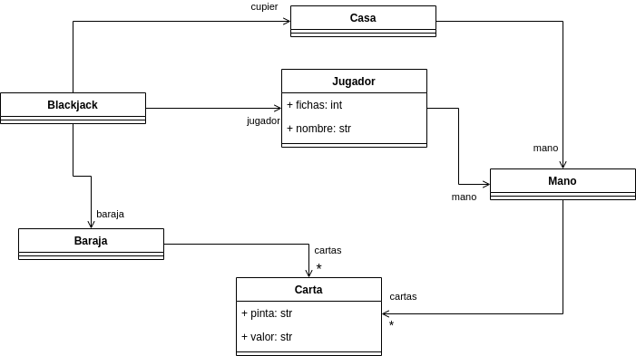
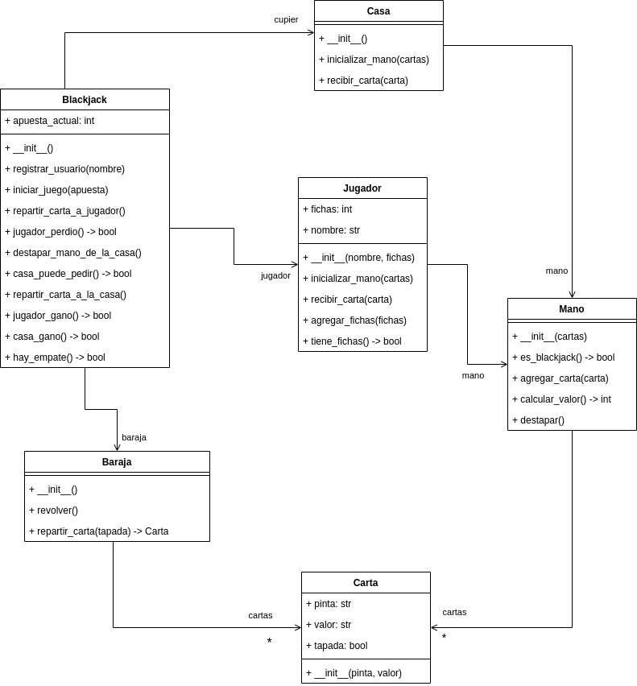

# Desarrollo de un juego de blackjack

## Descripción del juego
Este ejercicio consiste en desarrollar una aplicación para simular un juego de blackjack o 21 entre
un jugador y la casa (en este caso la casa está representada por el sistema). El objetivo del juego es
que la mano del jugador llegue lo más cerca posible a 21 sin pasarse. Si la mano del jugador se pasa
de 21, pierde el juego. Si no se pasa de 21, entonces se compara con la mano de la casa para ver
quien estuvo más cerca. Si la mano de la casa se pasa de 21, el jugador gana.

En el juego de blackjack hay una baraja que contiene 52 cartas. Cada carta tiene una pinta y un valor.
Las pintas pueden ser CORAZÓN, TRÉBOL, DIAMANTE y ESPADA; los valores pueden ser A, 2, 3, 4, 5,
6, 7, 8, 9, 10, J, Q, K.

Cada carta vale lo mismo que el número que representa, excepto las cartas cuyo valor es una letra.
Para estas cartas, el valor se determina así:

- Si la carta es J, Q o K, el valor es 10
- Si la carta es A, el valor puede ser 11 o 1 

Cuando arranca la aplicación, el sistema le pregunta el nombre al jugador para registrarlo y este
inicia el juego con 100 fichas.

Al iniciar el juego, el jugador decide cuantas fichas apostar y, luego de la apuesta, tanto el jugador
como la casa reciben una mano. La mano inicialmente contiene 2 cartas. Para el jugador ambas cartas
de la mano inicial están destapadas. Para la casa, una carta está destapada, la otra está oculta (boca
abajo).

Una vez se reparten las manos, inicia el turno del jugador. Si el valor de las cartas iniciales de la
mano del jugador suma 21, automáticamente gana el juego, ya que logró hacer blackjack. Si no es
así, entonces, el jugador puede pedir una nueva carta para su mano o detenerse. Si pide una nueva
carta, esta se suma al valor de su mano. Si el valor es mayor de 21, pierde inmediatamente el juego,
si no lo es puede seguir pidiendo cartas hasta que decida detenerse.

Cuando el jugador se detiene comienza el turno de la casa. En dicho turno, se destapa la carta oculta
de la mano de la casa y esta puede empezar a pedir cartas. La lógica de la casa para pedir cartas es
la siguiente:

- Si el valor de la mano de la casa es menor o igual al valor de la mano del jugador y el valor de la
mano de la casa no es mayor que 16, entonces pide una carta.
- Si con la nueva carta, el valor de la mano de la casa sobrepasa 21, la casa pierde el juego.

En caso de empate entre la casa y el jugador, el jugador recibe lo que apostó en la mano. Si el jugador
gana, la casa le dobla lo apostado. Y si el jugador pierda, se le resta lo apostado de sus fichas.

La idea es que la aplicación durante un juego vaya mostrando las manos tanto del jugador como de
la casa y le dé la opción al jugador de pedir una nueva carta o parar.

El jugador solo podrá jugar mientras tenga fichas disponibles para apostar.

## Modelo del mundo del problema

 

## Requisitos funcionales

### R1 - Registrar jugador

| <!-- --> 	      | <!-- --> 	                                                                                                                                                                                         |
|:----------------|:---------------------------------------------------------------------------------------------------------------------------------------------------------------------------------------------------|
| **Resumen** 	   | El sistema debe permitir registrar un jugador para poder iniciar un juego 	                                                                                                                        |
| **Entrada** 	   | - Nombre del jugador 	                                                                                                                                                                             |
| **Resultado** 	 | 1. El sistema muestra un mensaje dando la bienvenida al jugador 2. El sistema carga 100 fichas al jugador 3. El sistema muestra un menú con las opciones de iniciar un nuevo juego o salir 	 |

#### Descomposición del requisito

| Paso              | Método                       | Responsable |
|-------------------|------------------------------|-------------|
| Registrar jugador | registrar_jugador(nombre)    | Blackjack   |
| Crear jugador     | \_\_init\_\_(nombre, fichas) | Jugador     |

### R2 - Iniciar juego

|               	|                                                                                                                                                                                                                                                                                                                                                                                                                                 	|
|---------------	|---------------------------------------------------------------------------------------------------------------------------------------------------------------------------------------------------------------------------------------------------------------------------------------------------------------------------------------------------------------------------------------------------------------------------------	|
| **Resumen**   	| El sistema permite iniciar un juego, repartiendo las cartas al jugador y la casa                                                                                                                                                                                                                                                                                                                                                	|
| **Entradas**  	| - Apuesta del jugador                                                                                                                                                                                                                                                                                                                                                                                                           	|
| **Resultado** 	| 1. El sistema recibe la apuesta del jugador 2. Revolver las cartas 3. El sistema reparte dos cartas destapadas al jugador 4. El sistema reparte dos cartas a la casa, una destapada y la otra tapada 5. El sistema verifica si la mano del jugador es blackjack 5.1 Si tiene blackjack, se ejecuta el requisito R5 Finalizar juego 5.2 Si no tiene blackjack, se ejecuta el requisito R3 Hacer jugada jugador 	|

#### Descomposición del requisito

| Paso                              | Método                                | Responsable   |
|-----------------------------------|---------------------------------------|---------------|
| Iniciar juego                     | iniciar_juego(apuesta)                | Blackjack     |
| Revolver cartas                   | revolver()                            | Baraja        |
| Repartir carta                    | repartir_carta(tapada: bool) -> Carta | Baraja        |
| Inicializar la mano               | inicializar_mano(cartas)              | Casa, Jugador |
| Crear mano                        | \_\_init\_\_(cartas)                  | Mano          |
| Verificar si la mano es blackjack | es_blackjack() -> bool                | Mano          |

### R3 - Hacer jugador del jugador

|               	|                                                                                                                                                                                                                                                                                                                                                                                                                                                                                                                          	|
|---------------	|--------------------------------------------------------------------------------------------------------------------------------------------------------------------------------------------------------------------------------------------------------------------------------------------------------------------------------------------------------------------------------------------------------------------------------------------------------------------------------------------------------------------------	|
| **Resumen**   	| El sistema debe permitir que el jugador realice una jugada durante su turno                                                                                                                                                                                                                                                                                                                                                                                                                                              	|
| **Entradas**  	| - decisión (pedir carta o plantarse)                                                                                                                                                                                                                                                                                                                                                                                                                                                                                     	|
| **Resultado** 	| 1. El sistema solicita al jugador que seleccione una jugada 2. Si el jugador pide una carta 2.1 El sistema le reparte una carta a la mano del jugador 2.2 Si el valor de la mano del jugador es mayor a 21 2.2.1 Se ejecuta el requisito R5 finalizar juego 2.3 Si el valor de la mano no supera 21 2.3.1 Se vuelve a ejecutar el requisito R3 3. Si el jugador se planta  3.1 Se calcular el valor de la mano, se muestra y se guarda 3.2 Se ejecuta el requisito R4 hacer jugada de la casa 	|

#### Descomposición del requisito

| Paso                                  | Método                                | Responsable |
|---------------------------------------|---------------------------------------|-------------|
| Repartir carta a jugador              | repartir_carta_a_jugador()            | Blackjack   |
| Repartir carta                        | repartir_carta(tapada: bool) -> Carta | Baraja      |
| Recibir carta                         | recibir_carta(carta)                  | Jugador     |
| Agregar carta a mano                  | agregar_carta(carta)                  | Mano        |
| Calcular el valor de la mano          | calcular_valor() -> int               | Mano        |
| Verificar si el jugador se pasó de 21 | jugador_perdio() -> bool              | Blackjack   |

### R4 - Hacer jugada de la casa

|               	|                                                                                                                                                                                                                                                                                                                                                                                                                                                                                                                                                                                                                                 	|
|---------------	|---------------------------------------------------------------------------------------------------------------------------------------------------------------------------------------------------------------------------------------------------------------------------------------------------------------------------------------------------------------------------------------------------------------------------------------------------------------------------------------------------------------------------------------------------------------------------------------------------------------------------------	|
| **Resumen**   	| El sistema debe permitir que la casa realice una jugada durante su turno                                                                                                                                                                                                                                                                                                                                                                                                                                                                                                                                                        	|
| **Entradas**  	| Ninguna                                                                                                                                                                                                                                                                                                                                                                                                                                                                                                                                                                                                                         	|
| **Resultado** 	| 1. Destapar la carta oculta de la casa 2. Si la mano de la casa es blackjack 2.1 Se ejecuta el requisito R5 finalizar juego (la casa gana) 3. Si la mano de la casa no es blackjack 3.1 Si la mano de la casa es menor o igual que 16 y menor que la mano del jugador 3.1.1 Se reparte una carta a la mano de la casa 3.1.2 Se calcula el valor de la mano se vuelve a evaluar (punto 3.1) 3.2 Si la mano de la casa es mayor a 16 y menor o igual a 21 3.2.1 Se ejecuta el requisito R5 Finalizar juego 3.3 Si la mano de la casa se pasó de 21 3.3.1 Se ejecuta el requisito R5 Finalizar juego 	|

#### Descomposición del requisito

| Paso                                         | Método                               | Responsable |
|----------------------------------------------|--------------------------------------|-------------|
| Destapar la mano de la casa                  | destapar_mano_de_la_casa()           | Blackjack   |
| Destapar mano                                | destapar()                           | Mano        |
| Verificar si la mano de la casa es blackjack | es_blackjack() -> bool               | Mano        |
| Verificar si la casa puede pedir             | casa_puede_pedir() -> bool           | Blackjack   |
| Repartir carta a la casa                     | repartir_carta_a_la_casa()           | Blackjack   |
| Repartir carta                               | repartir_carta(tapada:bool) -> Carta | Baraja      |
| Agregar carta a la mano                      | recibir_carta(carta)                 | Casa        |
| Calcular valor de la mano                    | calcular_valor() -> int              | Mano        |

### R5 - Finalizar juego

|               	|                                                                                                                                                                                                                                                                                                                                                                                                                                                                                                                                                                                                                                                                                                                                                                                                                                                                                                           	|
|---------------	|-----------------------------------------------------------------------------------------------------------------------------------------------------------------------------------------------------------------------------------------------------------------------------------------------------------------------------------------------------------------------------------------------------------------------------------------------------------------------------------------------------------------------------------------------------------------------------------------------------------------------------------------------------------------------------------------------------------------------------------------------------------------------------------------------------------------------------------------------------------------------------------------------------------	|
| **Resumen**   	| El sistema debe permitir que se finalice la partida y se determine el ganador                                                                                                                                                                                                                                                                                                                                                                                                                                                                                                                                                                                                                                                                                                                                                                                                                             	|
| **Entradas**  	| Ninguna                                                                                                                                                                                                                                                                                                                                                                                                                                                                                                                                                                                                                                                                                                                                                                                                                                                                                                   	|
| **Resultado** 	| 1. El sistema compara las manos del jugador y de la casa  2. Si el jugador tiene blackjack, su mano es mayor que la mano de la casa o la mano de la casa superó 21  2.1 El sistema anuncia el jugador como ganador  2.2 Se doblan las fichas de la apuesta realizada  3. Si la casa tiene blackjack, su mano es mayor que la mano del jugador o la mano del jugador superó 21  3.1 El sistema anuncia que el jugador perdió  3.3 Se restan las fichas de la apuesta de las fichas del jugador  4. Si la mano del jugador y la mano de la casa tienen el mismo valor  4.1 El sistema anuncia empate  4.2 se devuelven las fichas apostadas al jugador 5. Si el usuario tiene fichas disponibles 5.1 Se presenta un menú con las opciones para iniciar un nuevo (R2) o salir de la aplicación 6. Si usuario no tiene fichas disponibles 6.1 Se termina la aplicación 	|

#### Descomposición del requisito

| Paso                              | Método                  | Responsable |
|-----------------------------------|-------------------------|-------------|
| Verificar si jugador ganó         | jugador_gano() -> bool  | Blackjack   |
| Agregar fichas al jugador         | agregar_fichas(fichas)  | Jugador     |
| Verificar si la casa ganó         | casa_gano() -> bool     | Blackjack   |
| Verificar si hay empate           | hay_empate() -> bool    | Blackjack   |
| Devolver fichas al jugador        | agregar_fichas(fichas)  | Jugador     |
| Verificar si jugador tiene fichas | tiene_fichas() -> bool  | Jugador     |

### Versión 1 del modelo del diseño de la solución

